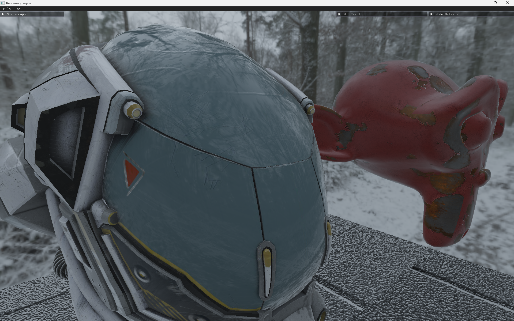

## This Repo contains a rendering engine.

### Screenshots:

### Features:

It has the following features:
- Text parser - 3d worlds can be built by creating a text file and passing it as an argument to the program. Sample text files are provided in the scenegraphmodels folder
- Hierarchial scenegraphs - Tree representation of the 3d world. This is by parsing text files. These files can be passed as an argument to the program.
- Dynamic transformation - Simple transformations at runtime such as rotations, translations and scales can be done wrt time and some samples are provided in the included text file.
- Physically based rendering - PBR workflow based on Epic Game's "Real Shading in Unreal Engine 4" SIGGRAPH paper.
- Pipelines - multiple swappable pipelines, with different feature sets for each pipeline.
- Multithreaded job-system - a job system that runs on parallel threads. Currently used for asset loading, UI and other updates,etc.
- Double-buffered command queue - A system where scenegraph updates are added to a queue and processed before the start of the frame. This is used along with jobs to implement asset loading and other heavy tasks
- Double-buffered Tasks - A system where you can load models and textures in parallel threads, then transfer to GPU memory in the main thread (this is because openGL is inherently single threaded, so running parallel gl commands on parallel threads will interweave them.)
- Cubemaps - Skyboxes using cubemaps with HDRI maps.
- IBL - Image Based lighting
- VXGI - Voxel Cone Traced Global Illumination for real-time indirect lighting (both specular and diffuse) and soft shadows.

Each pipeline contains different features I've implemented on top of the base software renderer. Some of them are:
- Shadow volumes - Each object casts shadows. This is done by stencil shadow volumes with blending between different light sources.
- Normal maps - Support for normal maps using bump-mapping.
- PBR - Physically Based Rendering
- VXGI - Voxel Cone Traced Global Illumination

Project overview:

This is NOT a class diagram, but something that can help if you want to go through the code.

The project follows MVC pattern, and uses a number of modular interfaces for different features like piplines, camera systems, controllers, jobs and tasks.

It also uses the visitor pattern for the scenegraph, which made it easy to implement features like GUI views, Bounding volume hierarchies, and even an Entity-Component System.

### To-do list:

- MSAA.
- Deferred rendering / clustered forward rendering.
- Spatial / Temporal upscaling
- Mesh simplification / decimation
- GPU Frustum culling
- MCP server

(This is not exhaustive)

### Requirements:

- OpenGL 4.5+
- C++ compiler (g++)
- Make utility
- The GI pipeline is currently only supported by NVidia GPUs - this is because it requires an extension in OpenGL for floating point image atomic writes that is available only on Nvidia GPUs. There are alternative methods for other GPUs, but since I only have an NVidia GPU, adding additional support is not the highest priority right now.

### Author's blog posts

https://vvgfx.github.io/IBL-VXGI

https://vvgfx.github.io/rendering-with-opengl

### References:

- https://ogldev.org/www/tutorial40/tutorial40.html  - Used this reference for shadow volumes.
- https://freestylized.com , https://freepbr.com/ - PBR textures. 
- https://learnopengl.com/ - Multiple references for PBR, Image based lighting, GPU Frustum culling, etc.
- https://wickedengine.net/2017/08/voxel-based-global-illumination/ - Global Illumination
- https://github.com/BoyBaykiller/IDKEngine - VXGI Implementation in openGL
- https://research.nvidia.com/sites/default/files/publications/GIVoxels-pg2011-authors.pdf - VXGI NVIDIA paper.

### Acknowledgements:

A huge thank you to my professor, Amit Shesh, for all his guidance.

Thank you, to the graphics community for paving the way and providing me with the motivation to continue building this.

Shoutout to https://freestylized.com , for providing me with the textures to make something beautiful.

### Assets:

All textures used in the sample scene are from https://freestylized.com . They have a royalty free license for all commercial and non-commercial purposes. They were converted to PPM P3 using GIMP (with ASCII export option.)
stylized wall: https://freestylized.com/material/stones_bricks_wall_01/
metal plates : https://freestylized.com/material/metal_plates_01/
Asphalt textures : https://ambientcg.com/

Models:
Suzanne (monkey) : Default blender model
Helmet : Khronos group git repo (https://github.com/KhronosGroup/glTF-Sample-Models/tree/main/2.0/DamagedHelmet)
